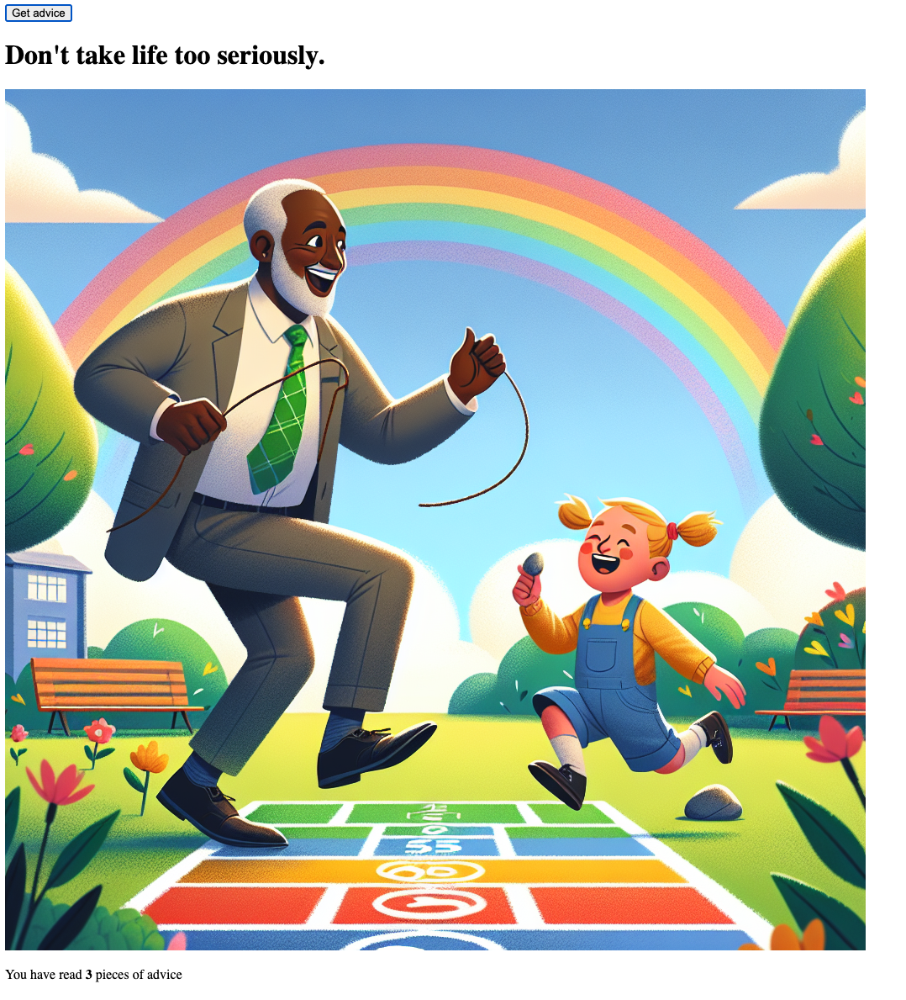

# AdviceBook

<!-- ### Your Personal Collection of Wisdom -->

As a guy in my 20s, I've always been keen on collecting bits of advice from people I look up to and summing up the lessons from my everyday experiences. That's what sparked "AdviceBook" -- It's all about bringing you a piece of advice with a twist.

Hit the "Get Advice" button, and you get some wise words and a cool image to go with it, thanks to the Adviceslip and OpenAI's DALL-E 3 APIs.
[Give it a try!](https://advicebook-354140ae5d78.herokuapp.com/)

<!-- -- a space where you can keep and share all those golden nuggets. Think of it as your personal cheat sheet of life. -->

<!-- **The Vision Ahead**
The idea is to evolve "AdviceBook" into an interactive platform where users can curate their own collection of advice, lessons, and quotes, complete with images. These collections could be personal or shared with others, creating a communal space for shared wisdom and experiences. Users will have the option to upload their own images or let AI craft an appropriate visual representation. -->

**A Quote to Share:**  
"You can't connect the dots looking forward; you can only connect them looking backwards. So you have to trust that the dots will somehow connect in your future. -- Steve Jobs"
